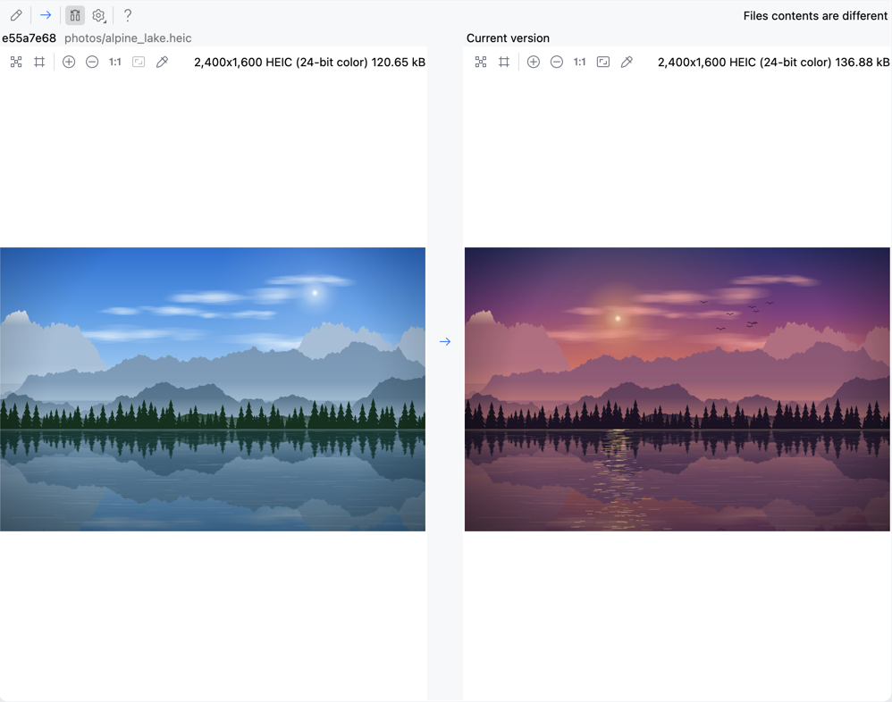

# HEIC Viewer

[](https://github.com/ZhuJHua/intellij-heic-viewer/actions/workflows/build.yml)
[](https://plugins.jetbrains.com/plugin/index?xmlId=cn.yooss.heic-viewer)
[](https://plugins.jetbrains.com/plugin/index?xmlId=cn.yooss.heic-viewer)
[](LICENSE)

[English](README.md) | 简体中文

在 Android Studio / IntelliJ 系列 IDE **自带的图片查看器**和**版本控制（VCS）差异对比**中查看 HEIC/HEIF 图片，支持 macOS、Windows 和 Linux。

插件把 `.heic`、`.heif`、`.hif`、`.heics` 加入平台自带的 “Image” 文件类型，并注册一个 `javax.imageio` 读取器，通过 IDE 自带的
JNA 调用**操作系统自己的 HEIF 解码器**：macOS 的 ImageIO.framework（系统自带）、Windows 10/11 的 WIC（需要 Microsoft Store 中的
“HEIF 图像扩展”（免费）和“HEVC 视频扩展”（付费））、Linux 的 libheif 1.x（需要它的 HEVC 解码器 libde265）。插件不附带任何解码器或本地代码；
缺少系统组件时，图片上方的横幅会说明需要安装什么，并给出 Microsoft Store 链接或当前 Linux 发行版的安装命令。

## 功能

- `.heic`、`.heif`、`.hif`、`.heics` 文件在 IDE **自带的图片查看器**中打开，和 PNG 完全一样：缩放、网格、棋盘格背景、
  工具栏右侧的信息标签（例如 `4032x3024 HEIC (24-bit color) 2.36 MB`）。
- **Git/VCS 差异对比**：修改过的 HEIC 文件在 Diff 窗口中显示为 IDE 自带的左右并排图片对比（`TwosideBinaryDiffViewer`，两侧缩放同步）。
  IDE 未运行时从命令行启动的 Diff/合并窗口（`studio diff`、`studio merge`、配置为使用 IDE 的 git difftool/mergetool）同样可以显示。
- 正确处理 **方向**：EXIF orientation 以及 HEIF 的 `irot`/`imir`，手机竖拍的照片显示为正向。
- 支持 **透明通道**（输出非预乘的 `TYPE_INT_ARGB`）、**10 bit** 图片、**网格（tile）图片**、多图文件和 `.heics` 序列（显示主图）。
- 超大图片按**像素预算**在解码时等比缩小（默认 64 百万像素，最长边不超过 16384），可在
  *Settings | Advanced Settings | HEIC Viewer* 中调整。
- **缩略图文件图标**：本地 HEIC 文件（不超过 64 MB）在项目视图（以及编辑器标签页、导航栏、Recent Files 等所有显示文件图标的地方）
  中显示为图片内容的小缩略图，而不是通用的图片图标。缩略图保持宽高比、居中、带一圈很淡的灰色描边，在 Retina 屏幕上按物理像素清晰绘制，
  浅色/深色主题下都适用。解码在后台进行，完成前显示普通的图片图标；可在 Advanced Settings 中关闭。
- 截断的文件显示为“Image not loaded”而不是全黑图片，也不会导致 IDE 崩溃。
- 不需要重启即可安装、更新、卸载（0.1.0 已在 AS 2026.1.4 和 2026.2.2 Canary 1 的沙盒里验证：卸载时类加载器被回收；
  0.2.0 的单元测试在 JDK 17、21、25 上验证同样的事情）。
- 缺少系统解码组件时（Windows 未安装扩展、Linux 未安装 libheif 或其 HEVC 解码器），HEIC 图片上方的横幅（差异对比和缩略图则是
  每个会话最多一次的通知）会说明需要安装什么，提供 Microsoft Store 页面或安装命令、“重新检测”（安装后无需重启即可显示 HEIC；
  Windows 上如果刚安装后仍提示缺少扩展，请重启 IDE）和“了解详情”。
- 不收集、不发送任何数据。

## 截图

内置图片查看器打开 HEIC，项目树里显示 HEIC 缩略图：


Git 中修改过的 HEIC 文件左右对比：



## 环境要求

- 基于 IntelliJ Platform **241.14494 或更新版本**的 IDE：IntelliJ IDEA / PyCharm / WebStorm / GoLand 等 **2024.1** 及更新版本，
  **Android Studio Koala**（2024.1.1）及更新版本。插件运行在 IDE 自带的 Java 上（2024.1 为 JBR 17，2024.2 – 2026.1.2 为 JBR 21，
  2026.1.3 起为 JBR 25）。
- **macOS**（Apple Silicon 或 Intel）：无需安装任何东西（ImageIO.framework 是 macOS 的一部分）。在 macOS 26 / Apple Silicon 上验证；
  解码测试也在 CI 的 Intel Mac 上运行。
- **Windows 10（1809 或更新）/ 11**（x64 或 arm64）：Microsoft Store 中的 *HEIF 图像扩展*（HEIF Image Extension，免费）和
  *HEVC 视频扩展*（HEVC Video Extensions，付费），部分电脑已预装两者。缺少哪个，插件就给出哪个的链接；详见
  [Windows: HEIF 和 HEVC 扩展](#windows-heif-和-hevc-扩展)。
- **Linux**（x64 或 arm64）：发行版软件包中的 libheif 1.x（`libheif.so.1`）及其 HEVC 解码器（libde265），例如 Ubuntu 24.04 上
  `sudo apt install libheif1 libheif-plugin-libde265`。缺少时插件会给出对应发行版的安装命令；其它发行版的命令见
  [Linux: libheif](#linux-libheif)。已用 libheif 1.12 至 1.23 测试；Ubuntu 20.04 的 libheif 1.6 能显示照片，但不能显示带透明通道或
  每通道 10 bit 的图片。

## 安装

- **JetBrains Marketplace**：<kbd>Settings</kbd> > <kbd>Plugins</kbd> > <kbd>Marketplace</kbd> > 搜索 “HEIC Viewer” > <kbd>Install</kbd>。
- **手动安装**：从 [GitHub Releases](https://github.com/ZhuJHua/intellij-heic-viewer/releases/latest)（或 JetBrains Marketplace）
  下载 `heic-viewer-<版本>.zip`，然后 <kbd>Settings</kbd>（⌘,）> <kbd>Plugins</kbd> > 齿轮图标 > <kbd>Install Plugin from Disk…</kbd>，
  选择该 zip 即可，无需重启。

### Windows: HEIF 和 HEVC 扩展

在 Windows 上，HEIC 图片由 Windows 图像组件（WIC）解码，需要 Microsoft Store 中的两个包：

| 包 | Store ID | 价格 | 提供 |
|---|---|---|---|
| *HEIF 图像扩展*（HEIF Image Extension） | [9PMMSR1CGPWG](https://apps.microsoft.com/detail/9PMMSR1CGPWG) | 免费 | WIC 的 HEIF 解码器（Windows 10 1809 或更新） |
| *HEVC 视频扩展*（HEVC Video Extensions） | [9NMZLZ57R3T7](https://apps.microsoft.com/detail/9NMZLZ57R3T7) | 付费（美国区 0.99 美元） | HEIC 照片使用的 HEVC 编码 |
| *来自设备制造商的 HEVC 视频扩展*（HEVC Video Extensions from Device Manufacturer） | [9N4WGH0Z6VHQ](https://apps.microsoft.com/detail/9N4WGH0Z6VHQ) | 免费，由电脑厂商预装（Store 中不能购买） | 同样的编码 |

缺少其中之一时，HEIC 图片上方的横幅会说明缺少哪个，并提供“打开 Microsoft Store”和“重新检测”；“更多”中还有商店网页（适用于没有
Store 应用的系统）、“了解详情”（本节），以及 HEIF 图像扩展的安装命令
`winget install --id 9PMMSR1CGPWG --source msstore --accept-package-agreements`（可复制）。安装后点“重新检测”，或直接切回 IDE，
无需重启即可显示 HEIC 图片。如果刚安装后“重新检测”仍提示缺少扩展，请重启 IDE：Windows 是否让已在运行的 IDE 使用之后安装的商店包，
尚未验证。

- 是否预装取决于 Windows 镜像和电脑厂商（GitHub Actions 的 Windows 11 25H2 镜像两者都有，Windows Server 2025 都没有）。
  在 PowerShell 中执行 `Get-AppxPackage *HEIFImageExtension*; Get-AppxPackage *HEVCVideoExtension*` 可以查看已安装的包。
- 没有 Microsoft Store 的版本（Windows Server、LTSC）无法从 Store 获得 HEVC 编码；在 Windows Server 2025 上 winget 可以安装
  HEIF 图像扩展，但装不了 HEVC 编码。
- Windows "N" 版本需要先安装 *媒体功能包*（Media Feature Pack，设置 > 应用 > 可选功能）：没有 Media Foundation 时两个扩展都无法解码
  HEIC，因此插件报告错误（`idea.log` 中 `HEIC decoder:` 一行会提到媒体功能包），而不是引导你去商店。
- 只支持 64 位 Windows（x64 和 arm64），与 IDE 一致。
- `idea.log` 中会记录检测结果：`HEIC decoder: Windows Imaging Component with the HEIF Image Extension through JNA 5.17.0 (amd64);
  CreateDecoder(HEIF): 0x00000000 (S_OK); test image: decoded (64x128); HEVC decoders: ...`，或者缺少组件时的错误码。

Store ID、价格和最低 Windows 版本来自 Microsoft Store 的商品目录（2026 年 9 月）和微软的
[HEIF 编解码器文档](https://learn.microsoft.com/windows/win32/wic/heif-codec)。

### Linux: libheif

在 Linux 上，HEIC 图片由系统的 libheif（`libheif.so.1`）及其 HEVC 解码器 libde265（较新的发行版中是单独的插件包）解码。
缺少其中之一时，HEIC 图片上方的横幅会给出当前发行版（根据 `/etc/os-release` 识别）的安装命令，可点“复制命令”；安装后点“重新检测”，
或直接切回 IDE，无需重启即可显示 HEIC 图片。

| 发行版 | 命令 |
|---|---|
| Ubuntu 23.10 及更新版本（24.04、26.04 等）、Debian 13 及更新版本、Linux Mint 22、Pop!_OS 24.04 等 | `sudo apt install libheif1 libheif-plugin-libde265` |
| Ubuntu 20.04 / 22.04、Debian 11 / 12、Linux Mint 20 / 21 等（libde265 直接链接在 libheif 中） | `sudo apt install libheif1` |
| Fedora：Fedora 自带的 libheif 因专利原因不含 HEVC 解码器，由 RPM Fusion Free 的 `libheif-freeworld` 提供 | `sudo dnf install https://mirrors.rpmfusion.org/free/fedora/rpmfusion-free-release-$(rpm -E %fedora).noarch.rpm && sudo dnf install libheif-freeworld` |
| RHEL、AlmaLinux、Rocky Linux、CentOS Stream：libheif 来自 EPEL，HEVC 解码器来自 RPM Fusion Free | `sudo dnf install --nogpgcheck https://dl.fedoraproject.org/pub/epel/epel-release-latest-$(rpm -E %rhel).noarch.rpm https://mirrors.rpmfusion.org/free/el/rpmfusion-free-release-$(rpm -E %rhel).noarch.rpm && sudo /usr/bin/crb enable && sudo dnf install libheif-freeworld` |
| openSUSE Tumbleweed、Slowroll、Leap：openSUSE 的 libheif 不含 HEVC 解码器，Packman Essentials 提供 `libheif-HEIF` | `sudo zypper addrepo -cfp 90 https://ftp.gwdg.de/pub/linux/misc/packman/suse/openSUSE_Tumbleweed/Essentials/ packman-essentials && sudo zypper --gpg-auto-import-keys refresh packman-essentials && sudo zypper install --from packman-essentials libheif1 libheif-HEIF`（其它版本分别为 `openSUSE_Slowroll`、`openSUSE_Leap_15.6` 等） |
| Arch Linux、Manjaro、EndeavourOS 等 | `sudo pacman -S --needed libheif libde265` |
| Alpine | `sudo apk add libheif` |
| NixOS | `nix-env -iA nixos.libheif.lib`，或在 `environment.systemPackages` 中加入 `pkgs.libheif.lib` |

已安装 libheif 但缺少 HEVC 解码器时，插件只要求安装解码器：Debian 和 Ubuntu 上为 `sudo apt install libheif-plugin-libde265`，
Alpine 3.24 及更新版本上为 `sudo apk add libheif-libde265`，其它发行版同上表。

- **Ubuntu 24.04 及更新版本**：自 2026 年 2 月起（24.04 中 `libheif1` 1.17.6-1ubuntu4.3，以及 25.10、26.04），
  `libheif-plugin-libde265` 只是“建议”安装的包（[LP: #2142762](https://bugs.launchpad.net/ubuntu/+source/libheif/+bug/2142762)），
  因此被其它软件包（ImageMagick、GIMP 等）顺带装上的 `libheif1` 本身无法解码 HEIC 照片。
- **NixOS** 没有全局的库路径：插件还会在 `/run/current-system/sw/lib`、`~/.nix-profile/lib` 和
  `/etc/profiles/per-user/<用户名>/lib` 中查找。
- **Flatpak** 版 IDE 只能看到其 Flatpak 运行时中的库。freedesktop 运行时 25.08 及更新版本自带 libheif（2026 年 9 月，Flathub 上的
  IntelliJ IDEA、Android Studio 和 WebStorm 使用 26.08，PhpStorm 使用 25.08），其 HEVC 解码器来自扩展
  `org.freedesktop.Platform.codecs-extra`，Flatpak 会随运行时一起安装，因此可以直接显示 HEIC。缺少该扩展时，横幅会给出
  `flatpak install flathub org.freedesktop.Platform.codecs-extra//<分支>-extra`（`<分支>` 为运行时的分支，如 `26.08`，可用
  `flatpak info <应用 ID>` 查看）；请在宿主系统中运行，不要在 IDE 的终端里运行。更旧的运行时无法解码 HEIC（24.08 的 libheif
  找不到 codecs-extra 中的插件，23.08 没有 libheif）：请使用 JetBrains Toolbox App、tar.gz 包或 Snap 安装的 IDE（JetBrains 的
  Snap 使用 classic 模式，照常能找到系统的库），或把下面的路径设置为沙箱内的 libheif。
- **其它位置**（自行编译的 libheif、其它安装前缀）：在 *Settings | Advanced Settings | HEIC Viewer | libheif 库* 中填写
  `libheif.so.1` 或其所在目录的路径。一旦加载了某个 libheif，另一个 libheif 要在重启 IDE 后才会使用：同一进程中的两个 libheif
  版本可能导致 IDE 崩溃。
- `idea.log` 中会记录查找结果：`HEIC decoder: libheif 1.17.6 (/usr/lib/x86_64-linux-gnu/libheif.so.1.17.6) with
  libde265 HEVC decoder ...`，或者尝试过哪些库、在哪些插件目录中查找过 HEVC 解码器。

包名于 2026 年 9 月依据以下来源核对：[packages.ubuntu.com](https://packages.ubuntu.com/search?keywords=libheif1)、
[packages.debian.org](https://packages.debian.org/search?keywords=libheif-plugin-libde265)、
[RPM Fusion](https://admin.rpmfusion.org/pkgdb/package/free/libheif-freeworld/)（[配置方法](https://rpmfusion.org/Configuration)、
[原因](https://discussion.fedoraproject.org/t/libheif-vs-libheif-freeworld/147974)）、
[packages.fedoraproject.org](https://packages.fedoraproject.org/pkgs/libheif/libheif/)、
[openSUSE:Factory/libheif](https://build.opensuse.org/package/show/openSUSE:Factory/libheif) 与
[Packman](https://ftp.gwdg.de/pub/linux/misc/packman/suse/openSUSE_Tumbleweed/Essentials/)、
[archlinux.org](https://archlinux.org/packages/extra/x86_64/libheif/)、[Alpine](https://pkgs.alpinelinux.org/packages?name=libheif*)
以及 [nixpkgs](https://github.com/NixOS/nixpkgs/blob/nixos-unstable/pkgs/by-name/li/libheif/package.nix)；CI 中的
*Linux install commands* 任务会在这些发行版的容器中实际执行这些命令。

## 设置

*Settings | Advanced Settings | HEIC Viewer*：

- **解码图片的最大尺寸（百万像素）**（`heic.viewer.max.megapixels`），默认 64，范围 1–512。超过的图片在解码时等比缩小
  （最长边另外限制为 16384）。IDE 的图片查看器总是请求原始分辨率，而 Diff 会同时解码两张图，这个预算用来限制内存占用。
- **用缩略图作为 HEIC 文件图标**（`heic.viewer.project.view.thumbnails`），默认开启。关闭后所有 HEIC 文件恢复为普通图片图标。
  修改在点击 OK/Apply 后生效：已显示的图标在设置对话框关闭后立即刷新（不需要重新打开项目）。
- **libheif 库**（`heic.viewer.libheif.path`，仅 Linux），默认为空（使用系统的 libheif）。填写 `libheif.so.1` 或其所在目录的路径，
  用于不在系统库路径中的 libheif（见 [Linux: libheif](#linux-libheif)）。下次启动 IDE 后生效；只有在 IDE 尚未加载任何 libheif 时，点击横幅/通知中的“重新检测”也会生效。

## 限制与已知问题

- 解码依赖操作系统自带的解码器。没有它时（Windows / Linux 未安装[环境要求](#环境要求)中的组件，或其它操作系统），HEIC 文件仍以图片类型打开，
  但显示 “Image not loaded”；图片上方的横幅（差异对比和缩略图则是每个会话最多一次的通知）会说明需要安装什么。点“重新检测”，
  或打开商店页面/复制安装命令后回到 IDE，已打开的 HEIC 图片无需重启即可显示（Windows 上如果仍提示缺少扩展，请重启 IDE）；
  已打开的差异对比需要重新打开。
- 颜色统一转换到 **sRGB**：Display P3 照片中超出 sRGB 的颜色会被裁剪。
- **HDR 增益图（gain map）被忽略**，显示的是标准动态范围的基础图像。
- 只显示文件的**主图**；多图文件、`.heics` 序列的其它帧、深度图等辅助图像不显示。
- 超过像素预算的图片会被缩小：编辑器信息标签显示的是解码后的尺寸，而文档弹窗/补全中的尺寸是原始尺寸。
- 截断的文件显示为 “Image not loaded”（日志中有具体原因）；长度完整但压缩数据损坏的文件（位翻转、预分配后未写完的零填充尾部等）
  仍可能显示为全黑，因为系统解码器（至少 macOS 的 ImageIO.framework）对此不报告任何错误。
- **IJPL-39443**：IDE 在插件被卸载期间保存设置时，会在 `filetypes.xml` 里写入 `<removed_mapping ext="heic" type="Image"/>`。
  插件启动时会把这类“不属于任何文件类型”的扩展名重新关联到 Image（用户显式映射到其它类型的扩展名不会被改动）。
  因此卸载插件后 `filetypes.xml` 中会留下显式的 `<mapping ext="heic" type="Image"/>`（此时 `.heic` 会以图片类型打开但没有读取器，
  可在 *Settings | Editor | File Types* 中删除）。反过来，如果手动把 heic 从 Image 类型中移除（未映射到其它类型），
  插件下次启动时会重新关联；要让 HEIC 不再作为图片打开，请禁用插件。
- 免重启安装时如果已经打开了 HEIC 标签页，需要关闭后重新打开。
- 安装插件之前已被 IDE 索引过的 HEIC 文件，在补全/文档弹窗中的尺寸信息要等文件变化或重建索引后才会出现。
- AVIF 不在本插件处理范围内（AVIF 头会被明确拒绝）。
- 缩略图：`FileIconProvider` 无法区分调用场景，所以缩略图会出现在所有显示文件图标的地方（项目视图、编辑器标签页、导航栏、
  Recent Files、Search Everywhere 等）。非本地文件（jar/归档内、远程、Diff 中的历史版本）和超过 64 MB 的文件使用普通图片图标。
  第一次显示某个文件时会先短暂显示普通图标；一个目录下有大量 HEIC 文件时，缩略图按 2 个线程逐个出现。缓存最多 500 个图标，
  超出后最久未使用的会在需要时重新解码。
- **Windows 上的颜色**：微软的 HEIF 解码器（HEIF 图像扩展 1.2.36，在 CI 中实测）有两个颜色转换错误，插件在内存中绕过了它们
  （不修改文件）：
  - 主图是单张 8 bit 图片（不是网格）的文件，无论文件标明什么，都按 BT.709 矩阵转换，因此 libheif 和 macOS 写入的 BT.601
    颜色会偏（纯红解码为 (255, 25, 0)）。插件把这类文件作为只有一个 tile 的网格交给 Windows，Windows 会按文件标明的矩阵和
    范围转换。
  - `nclx` 标明 BT.709 或"未指定"传输曲线（macOS 写入后者）的网格图片和 10 bit 图片，会从该曲线转换到 sRGB，暗部比其他所有
    查看器都亮。插件把这些曲线当作 sRGB 交给 Windows，与 macOS 和 libheif 的处理一致。

  iPhone 照片（带 ICC 配置文件的网格）不受影响。"照片"等 Windows 应用仍会显示这些错误。`-Dheic.viewer.windows.colorFixes=false`
  可关闭这些修正。8 bit 单色（灰度）HEIC 图片在 Windows 上解码为全黑。
- **Windows**：IDE 启动后的第一张 HEIC 图片可能需要一两秒（Windows 激活 Store 包）；可用性检测在启动时于后台承担这部分开销。
- **Linux**：
  - libheif 以软件方式按原始分辨率解码，插件再缩小，因此比 macOS 慢（以 Apple M 系列上的 libheif 1.23 实测：像 iPhone 那样
    由 512 像素图块组成的 1200 万像素照片约 0.3 秒，单个 1200 万像素图块约 0.7 秒）；无论显示尺寸多大，解码期间都需要每像素约
    4.5–6 字节的本地内存，因此超过约 2.68 亿像素（16384 × 16384）的图片不会解码（显示 “Image not loaded”；libheif 1.17 及更早版本
    改为限制每边约 23000 像素）。文件图标会使用文件内嵌的缩略图，因而很快。
  - ICC 颜色配置文件会转换为 sRGB（Java 的色彩管理）；但只用 `nclx` 标注、原色不是 sRGB/BT.709 的颜色（例如没有 ICC 配置文件的
    Display P3 或 BT.2020）不做转换，显示得略微偏淡；HDR 图片（PQ/HLG 传递函数）看起来发灰。
  - 方向取自 HEIF 变换（`irot`、`imir`，由 libheif 应用）；没有这些变换、只有 EXIF 方向的文件（相机和手机不会这样写，它们两者都写）
    不会被旋转。
  - 旧版 libheif 能解码的内容较少：Ubuntu 20.04 的 libheif 1.6 解码带透明通道的图片会失败，也不能读取 10 bit 文件（品牌 `heix`），
    这些文件显示 “Image not loaded”。CI 检查了 libheif 1.6、1.12、1.15、1.16、1.17、1.19、1.21 和 1.23。
- 尚未在真实 IDE 中验证：Windows（解码测试在 CI 的 Windows 11 arm64 上实际解码 HEIC，并在没有 HEIF/HEVC 扩展的 Windows Server 2025
  x64 上通过）、Linux（解码测试在 CI 的 Ubuntu 22.04 和 24.04、x64 和 arm64 上通过）、Intel Mac（解码测试在 CI 中通过）、
  macOS 26 以前的版本、Git LFS 管理的 HEIC。

## 工作原理

1. **文件类型**：`META-INF/plugin.xml` 中的 `<fileType name="Image" extensions="heic;heif;hif;heics"/>`（不带
   `implementationClass`）把扩展名合并到平台已有的 “Image” 文件类型上（和 AS 自带的 WebP 支持同样的做法）。于是
   `ImageFileEditorProvider` 接管编辑器，Diff 中两侧内容也会用图片编辑器显示。所有扩展都声明在 `plugin.xml` 中，在所有操作系统上加载；
   插件不依赖任何操作系统模块（在 IntelliJ 2024.1 – 2025.1 中，即使是可选的操作系统依赖也会让 IDE 在其它系统上拒绝加载插件）。
2. **ImageIO 读取器**：IDE 的 `IfsUtil`（编辑器、Diff）和 `ImageInfoReader`（图片信息索引、补全、文档弹窗）都是用
   `ImageIO.getImageReaders(stream)` 按内容嗅探来选读取器的。插件注册 `HeicImageReaderSpi`：
   - `canDecodeInput` 只运行纯 Java 的 `HeifSniffer`（解析 `ftyp` box，最多 512 字节），绝不加载本地代码、绝不抛出异常，
     所以即使本地层出错也不会影响 PNG/JPEG 等其它格式；
   - AVIF（`avif/avis/avio` 品牌）、MP4/MOV 等被明确拒绝；
   - `getFormatName()` 为 `heic`，信息标签显示 `HEIC`；不解码像素即可给出宽高（已考虑方向）。
3. **解码后端**（`backend` 包）：`HeifBackend` 是与平台无关的解码接口（`readInfo`、`decode(maxPixelSize)`、
   `decodeThumbnail(maxPixelSize)`，以及带缓存的可用性探测 `status()`，返回 `HeifBackendStatus`：可用，或不可用并附带机器可读的原因
   （如 `WINDOWS_HEIF_EXTENSION_MISSING`、`LINUX_LIBHEIF_MISSING`）、说明文字，以及可选的安装页面和安装命令）。
   `HeifBackends` 按操作系统选择后端：

   | 操作系统 | 后端 | 系统解码器 |
   |---|---|---|
   | macOS | `mac.MacHeifBackend` | ImageIO.framework |
   | Windows | `win.WicHeifBackend` | Windows 图像组件（WIC）+ Microsoft Store 的 HEIF 图像扩展和 HEVC 视频扩展 |
   | Linux | `linux.LibheifHeifBackend` | libheif 1.x（`libheif.so.1`）+ HEVC 解码器（libde265） |

   `AbstractHeifBackend` 实现各平台相同的部分：任何本地调用之前，数据必须通过 `HeifInput`（`HeifSniffer` 检查——系统解码器按内容选择
   解码器，其它格式绝不能交给它；以及纯 Java 的 `IsoBoxes` 检查顶层 box 与 `iloc` 数据区是否完整——ImageIO.framework 会把截断的文件
   “成功”解码成黑图）；不可用的后端以 `IOException` 失败；本地层的异常（包括 `LinkageError`）都转换为 `IOException`。
   `PixelPipeline` 把本地像素缓冲区按条带转换为 `BufferedImage`（8 bit sRGB，不透明为 `TYPE_INT_RGB`，带透明通道为非预乘的
   `TYPE_INT_ARGB`），并为无法在本地完成这些工作的解码器提供反预乘、EXIF/HEIF 方向变换、缩小和 ICC 到 sRGB 的转换。
   本地代码只通过 IDE 自带的 JNA 调用（`backend.jna.JnaLibraries`）：只使用它的无类型层（`NativeLibrary`、参数为 JDK 类型的
   `Function.invoke*`、`Native.malloc`/`free`），绝不使用 `Library` 接口、`Structure`、回调或 `Memory`——JNA 对它们的缓存会一直持有
   插件的类加载器；打开本地库时也保证 JNA 的 Cleaner 线程不会继承插件的上下文。

   **macOS 解码**（`mac` 包）：`HeicDecoder` 的流程：`CFDataCreate` → `CGImageSourceCreateWithData(ShouldCache=false)` → 主图属性 →
   `CGImageSourceCreateThumbnailAtIndex(FromImageAlways, WithTransform, ThumbnailMaxPixelSize, ShouldCacheImmediately)`
   → 以约 100 万像素为一条带（最多 8 条：ImageIO 无法缓存解码结果时，例如格式有误的文件，每画一条都要重新解码整张图），经
   `CGImageCreateWithImageInRect` 裁剪后绘制到显式的 8 bit **sRGB** 位图上下文 →
   复制到 `BufferedImage`。带透明通道、且请求的尺寸更小（例如缩略图）的图片（不超过 6400 万像素）按原尺寸解码，在读取条带时由
   `PlaneConverter` 按 alpha 加权缩小：ImageIO 的缩略图缩放并非在所有 Mac 上都按 alpha 加权，透明像素下的黑色会使边缘变暗。
   每次调用都有自己的 autorelease pool，所有 CF 对象和本地缓冲区在 `finally` 中释放，线程安全。
   ImageIO 报告的类型必须属于 HEIF 家族（`public.heic`、`public.heif` 等）。`MacApi` 列出它需要的本地调用，由 `jna.JnaMacApi` 实现；
   按值传递的 `CGRect` 在 arm64 上作为 4 个 double 传递，在 x86_64 上先用 8 个占位 double 填满 `xmm0`–`xmm7`，再把 4 个分量放到栈上。

   **Windows 解码**（`win` 包）：`WicDecoder` 在调用线程上初始化 COM（`CoInitializeEx` 多线程套间，结束时用 `CoUninitialize`
   配对；已经处于单线程套间的线程，例如 AWT 线程，按原样使用），创建 WIC 图像工厂、内存流（`SHCreateMemStream`）和解码器
   （`CreateDecoderFromStream`，解码器报告的容器格式必须是 `GUID_ContainerFormatHeif`），取第 0 帧即主图。微软的 HEIF 解码器
   自己应用 HEIF 的 `irot`/`imir`，并报告 `System.Photo.Orientation` = 1（按 HEIF 标准忽略 EXIF 方向；插件仍会应用报告的方向）。
   它的帧总是 32 位 BGR：透明通道通过 `IWICBitmapSourceTransform` 以单独的 8 位平面提供。帧依次经过 `IWICBitmapScaler`
   （Fant，仅在图片大于请求尺寸时）、`IWICFormatConverter` 和 `CreateBitmapFromSource`（只解码一次），再按条带复制到
   `BufferedImage`。带透明通道的图片（不超过 6400 万像素）不由 WIC 缩放：WIC 会分别缩放颜色和透明平面，透明像素下的黑色会让边缘变暗；
   插件把全尺寸的帧和透明平面逐条合并，由 `PlaneConverter` 按透明度加权缩小（与 Linux 相同）。内嵌的 ICC 配置文件（例如 Display P3）
   由 `PixelPipeline` 转换到 sRGB。所有 COM 对象和缓冲区在任何路径上都会释放。
   `WinApi` 列出所需的本地调用，由 `jna.JnaWinApi` 通过 JNA 的 `Function` 以 COM 虚表调用实现（虚表槽位取自 Windows SDK 的
   `wincodec.idl`，并与 mingw-w64 头文件核对）；`MFTEnumEx` 按值接收 GUID，在 x64 上以指向副本的指针传递，在 arm64 上用两个寄存器传递。
   `WicProbe` 通过解码一个 428 字节的内嵌 HEIC 并向 Media Foundation 查询 HEVC 解码器来确定状态：没有 HEIF 解码器
   （`WINCODEC_ERR_COMPONENTINITIALIZEFAILURE`）为 `WINDOWS_HEIF_EXTENSION_MISSING`，没有 HEVC 编码
   （`MF_E_TOPO_CODEC_NOT_FOUND`、没有 HEVC 解码器）为 `WINDOWS_HEVC_EXTENSION_MISSING`，并附上对应的 Microsoft Store 页面
   （产品 ID 见 `WindowsCodecs`）。

   **Linux 解码**（`linux` 包）：`Libheif` 绑定 libheif 的 C API（只用 libheif 1.6 起就有的函数；`heif_init` 等较新的函数存在时才调用）。
   探测时加载 `libheif.so.1`（其次是 `heif`、NixOS 的 profile 目录，或设置中指定的路径），调用一次 `heif_init`（它会加载编解码插件；
   从不调用 `heif_deinit`：libheif 的初始化是进程级的，插件必须对其它使用者、以及插件卸载时仍在进行的解码保持加载），再询问
   `heif_have_decoder_for_format(HEVC)`；没有解码器时重新扫描插件目录（这样“重新检测”能找到期间安装的插件），仍然没有则报告
   `LINUX_HEVC_PLUGIN_MISSING`。`LinuxDistribution` 读取 `/etc/os-release`，`LibheifRemedy` 据此给出安装命令。`LibheifDecoder` 把数据
   复制到本地内存（`heif_context_read_from_memory_without_copy` 会一直引用它，直到上下文释放），取得主图句柄（其尺寸就是显示尺寸：
   libheif 解码时应用 `irot`/`imir`/`clap`），用 `heif_decode_image` 解码为交错的 8 bit RGB 或 RGBA，并按条带读取；`PlaneConverter`
   在读取的同时缩小（先按最大整数倍做按 alpha 加权的盒式滤波，再做一次双线性缩放），Java 堆中不会出现比请求尺寸更大的图像。
   ICC 配置文件通过 `PixelPipeline` 转换为 sRGB。`decodeThumbnail` 在内嵌缩略图宽高比相同且不小于请求尺寸时使用它。
   libheif 按值返回 16 字节的 `struct heif_error`：在 x86-64（System V）和 AArch64 上，这样的结构体通过两个寄存器返回
   （`RAX`/`RDX`、`X0`/`X1`），因此用 `Function.invokeLong` 调用这些函数，第一个寄存器中低 32 位是 `code`、高 32 位是 `subcode`；
   其它架构不支持。所有上下文、句柄、图像和本地缓冲区都在 `finally` 中释放。
4. **注册时机**：`AppLifecycleListener.appFrameCreated`（正常启动，在恢复项目/编辑器标签之前）、
   `DynamicPluginListener.pluginLoaded/beforePluginUnload`（免重启安装/更新/卸载），以及 `HeicReaderRegistrar`：一个只针对
   Image 文件类型的 `fileEditorProvider`，它的 `accept` 注册读取器并始终返回 `false`。命令行启动的 Diff/合并窗口（IDE 未运行时执行
   `studio diff a.heic b.heic` 等）不会创建 IDE 主窗口、不会触发 `appFrameCreated`，但在创建图片查看器之前会询问编辑器提供者。
   它从不创建编辑器，所以插件加载/卸载不会影响已打开的编辑器和 Diff 窗口；`beforePluginUnload` 之后不会再注册读取器。
   注册器会移除旧类加载器残留的同名读取器，并通过 `IIORegistry.setOrdering` 让本插件优先于其它插件提供的 HEIF 读取器。
   刻意**不**使用 `ApplicationLoadListener`（内部 API、不支持动态加载）和 262 新增的 `imageReaderWriterSpi` 扩展点（在 262 之前的版本上会导致
   无法免重启卸载），也**不**提供 `META-INF/services` 条目。
   注册后 `HeicSupport` 会检查 `ImageIO` 本身能否找到该读取器：`IIORegistry.getDefaultInstance()` 不是线程安全的，IDE 启动时若有两个
   线程同时首次调用它，`ImageIO` 可能在整个会话中使用另一个注册表（Android Studio 2026.2 Canary 上曾有一次启动后所有 HEIC 图片都无法
   加载，这是最可能的原因）。此时会通过
   `ImageIO.scanForPlugins()`（配合一个只声明本读取器的上下文类加载器）向 `ImageIO` 的注册表再注册一个实例，卸载时一并移除，
   并在 `idea.log` 中以警告记录这一情况。
5. **IJPL-39443 修复**（`HeicFileTypeMappingRepair`）：插件在启动/加载时同步（只读）检查：如果某扩展名当前不属于任何文件类型，才在 EDT 上
   重新关联到 Image（用户显式映射到其它类型的扩展名不会被改动）。正常启动时不向 EDT 投递任何事件（原因见第 8 条）。
6. **缺少解码器的提示**（`ui` 包）：注册读取器后在后台线程探测后端状态；界面只读取后端缓存的状态，从不在 EDT 上探测（`DecoderStatus`）。
   解码器不可用时，在 HEIC 图片无法显示的地方告诉用户原因和对应的解决办法（`backend.HeifRemedies`）：Windows 上是“打开 Microsoft Store”
   （缺少的那个包在 Store 应用中的页面，数据来自 `win.WindowsCodecs`）、“重新检测”，以及“更多”中的 winget 命令、商店网页和“了解详情”；
   Linux 上是当前发行版的安装命令（`linux.LibheifRemedy`，横幅中直接显示）以及“复制命令”、“重新检测”、“了解详情”（没有适用于当前系统的
   命令时改为 README 中的安装说明）；意外错误为“重新检测”和“报告问题”，不支持的系统为“了解详情”：
   - HEIC 图片编辑器上方的**横幅**（`HeicDecoderNotificationProvider`，`editorNotificationProvider`）。平台只会主动为文本编辑器收集横幅，
     所以解码器缺失时，`HeicFileOpenedListener` 会在打开 HEIC 文件时请求更新横幅；
   - 没有横幅的地方显示**通知**（通知组 “HEIC Viewer”，气泡），每个会话最多一次：打开 HEIC 文件的差异对比（`HeicDiffExtension`，
     `diff.DiffExtension`）、未打开的文件生成缩略图失败，或刚安装插件时；“不再显示”按原因分别记录。

   “重新检测”在后台线程重新探测。找到解码器后横幅消失，已打开的 HEIC 编辑器重新加载图片（`ImageEditorImpl.refreshFile()`，与文件在
   磁盘上改变时相同），缩略图重新解码，并用通知确认；仍然缺失时，通知会说明现在缺少什么。用户打开商店页面或复制安装命令后，IDE 窗口下次
   被激活时会自动重新检测（`HeicActivationListener`，有防抖，30 分钟内有效）。解码器可用的正常启动不显示任何内容，也不向 EDT 投递事件。
   卸载插件前会主动移除它的横幅（IntelliJ 2026.1 会把已卸载提供者的面板留在编辑器里，导致类加载器无法回收），并让它的通知过期。
   `-Dheic.viewer.debug.backendStatus=<REASON>[|<url>[|<command>]]` 可以强制指定状态，用于查看其它操作系统上的界面；加上
   `-Dheic.viewer.debug.backendStatus.recover=true` 后，第一次“重新检测”会切换到当前系统真正的解码器。
7. **缩略图文件图标**（`thumbnail` 包）：
   - `HeicThumbnailIconProvider`（`com.intellij.fileIconProvider`，`order="first"`，动态扩展点）只对本地
     （`isInLocalFileSystem`）、非空、不超过 64 MB、扩展名为 heic/heif/hif/heics 的文件、且设置开启时工作。`getIcon` **从不解码**：
     只查 LRU 缓存（500 项，键 = URL + VFS 时间戳 + 文件长度 + 图标逻辑尺寸 + 最大屏幕缩放），未命中时把解码任务交给插件自己的
     有界线程池（`AppExecutorUtil.createBoundedApplicationPoolExecutor`，最多 2 个线程，同一个键只排队一次）并返回 `null`，
     平台于是显示 Image 文件类型的默认图标；解码失败会被缓存（文件变化后键也会变化，自动重试）。
   - 后台任务直接从磁盘读取文件（不经过 VFS，避免照片内容进入 VFS 内容缓存；只有文件头是 HEIC/HEIF `ftyp` box 时才读取全文，
     仅仅以 `.heic` 命名的其它格式文件绝不会交给系统解码器），调用后端的
     `decodeThumbnail(bytes, 2 × 最大物理像素尺寸)`（Retina 上为 64，允许使用文件内嵌缩略图），再用纯 Java2D
     渲染成正方形图标：多次对半双线性缩小（避免锯齿）、等比居中、透明背景、1 个物理像素的半透明灰色描边。结果是
     `JBImageIcon` 包着一个 JDK 的 `BaseMultiResolutionImage`（1x 和最大屏幕缩放两个版本），Java2D 按绘制时的设备缩放选择版本，
     所以 Retina 和普通屏幕上都是 1:1 的物理像素。
   - 缩略图就绪后，在 EDT 上（合并为一次 `invokeLater`）对该文件发布公开 API
     `VirtualFileAppearanceListener.fireVirtualFileAppearanceChanged`：平台会清空 `IconDeferrer` 缓存，项目视图
     （`ProjectFileNodeUpdater`）更新该文件的节点，编辑器标签页、导航栏更新显示，再次询问 provider 时即返回缓存中的图标。
   - 为什么不用平台的延迟图标（`IconDeferrer.defer` / `IconManager.createDeferredIcon`）：在 AS 261 的字节码中，
     `IconUtil.getIcon(file)` 本身已经把整个文件图标（包括所有 `FileIconProvider`）包在
     `IconManager.createDeferredIcon(FileIconKey)` 里，在后台的 `readAction { }` 中计算；嵌套的 `IconDeferrerImpl.defer` 在
     `isEvaluationInProgress` 时会**同步**执行求值函数——也就是说解码会在读锁里进行，阻塞写操作。另外 `DeferredIconImpl` 在求值完成前
     一直持有插件的求值 lambda（`evaluator` 字段，`setDone` 时才置空），项目视图中尚未绘制的节点会因此在卸载后继续引用插件的类加载器。
   - **免重启卸载**：交给平台的对象（图标、图片）全部是平台/JDK 类，平台缓存（`IconDeferrer`、`LastComputedIconCache`、
     树节点）不会引用插件的类；`HeicDynamicPluginListener.beforePluginUnload` 调用 `HeicThumbnails.shutDown()`：取消排队中的解码、
     关闭线程池并等待正在运行的解码（最多 1 秒）、清空缓存；排队中的 EDT 任务通过 `expired` 条件失效（`DynamicPlugins` 卸载时会调用 `LaterInvocator.purgeExpiredItems`，
     并清空 `IconDeferrer` 缓存）。设置监听器和 VFS 监听器都是声明式的 `applicationListeners`，由平台自动注销。
   - 切换设置（`AdvancedSettingsChangeListener`）会立即清空缓存，并对所有请求过图标的文件发布外观变化，关闭设置对话框后
     项目视图即切换为缩略图/默认图标，无需重新打开项目。HEIC 文件在磁盘上被修改时（`BulkFileListener`，只比较字符串）同样刷新。
8. **Java 17 与免重启卸载**：插件以 `--release 17` 编译。在 JBR 17（IntelliJ 2024.1）上，有两件事会让插件卸载后类加载器仍被持有，所以都不使用：
   record（JDK 会缓存它的 `equals`/`hashCode`/`toString` 引导方法；`DecodeLimits` 等值类改为手写），以及正常启动时由插件代码向 EDT
   投递事件（见第 5 条）。`BytecodeLevelTest` 检查打包后的 jar（class 版本、没有 record、没有 `java.lang.foreign`、JNA 规则），
   `PluginClassLoaderLeakTest` 在 JDK 17、21、25 上验证：插件解码图片并关闭后，类加载器可以被回收。

## 开发

### 环境

- 在 macOS、Windows、Linux 上都能构建和测试。解码测试只在系统解码器可用的地方运行（macOS；安装了[环境要求](#环境要求)中组件的
  Windows / Linux），其余测试在任何系统上运行。Linux 后端（`linux` 包）的测试在 macOS 上也会使用 Homebrew 的 libheif
  （`brew install libheif`）或 `HEIC_TEST_LIBHEIF=/path/to/libheif` 指定的 libheif 运行，并把结果与 ImageIO.framework 的解码结果比较。
- JDK 25 作为 Gradle toolchain（代码以 `--release 17` 编译），另外 `testJdk21` / `testJdk17` 需要 JDK 21 和 JDK 17。Gradle 会使用
  已安装的 JDK（包括运行 Gradle 本身的 JDK），找不到时由 foojay 插件自动下载（复用 IDE 自带 JBR 25 的方法见下文）。
- Gradle 9.4.1（wrapper 已包含），IntelliJ Platform Gradle Plugin 2.19.0，版本统一记录在 `gradle/libs.versions.toml`。

### 使用本地安装的 IDE，而不是下载（`local.properties`）

默认情况下（例如 CI、新克隆的仓库），构建会下载并缓存 `gradle.properties` 中 `platformType` / `platformVersion` 指定的 IDE
（Android Studio 2026.1.4.8，约 1.5 GB）。如果想直接针对本机已安装的 IDE 编译、运行和校验，在项目根目录创建
`local.properties`（已在 `.gitignore` 中忽略，不会提交）：

```properties
# 编译、runIde、verifyPlugin 所用的本地 IDE
platformLocalPath=/Applications/Android Studio.app
# 可选：第二个本地 IDE（如 Canary），用于 runIdeCanary 和 verifyPlugin
platformCanaryPath=/Applications/Android Studio Preview.app
# 可选：本地签名用的 chain.crt + private_encrypted.pem 所在目录（默认 ~/.jetbrains-sign）
#jetbrainsSignDir=/path/to/signing
```

| 属性 | 含义 |
|---|---|
| `platformLocalPath` | 编译、运行（`runIde`）、校验（`verifyPlugin`）所用的本地 IDE；不设置时下载 `platformType`/`platformVersion` |
| `platformCanaryPath` | 可选；存在时用于 `runIdeCanary`，并在设置了 `platformLocalPath` 时一起参与 `verifyPlugin` |
| `jetbrainsSignDir` | 可选；本地签名证书目录（默认 `~/.jetbrains-sign`），密码来自环境变量 `PRIVATE_KEY_PASSWORD` |

同名的 Gradle 属性（`-PplatformLocalPath=...` 或 `~/.gradle/gradle.properties`）优先于 `local.properties`；空值表示禁用，
例如 `./gradlew build -PplatformLocalPath=` 会和 CI 一样下载 IDE 构建。

**复用 IDE 自带的 JBR 25 作为 JDK**：Gradle toolchain 不能从 `local.properties` 配置。要避免 foojay 下载 JDK，可以让 Gradle
运行在该 JBR 上（`export JAVA_HOME="/Applications/Android Studio.app/Contents/jbr/Contents/Home"`，或在 IDE 的 Gradle 设置中把
Gradle JVM 选为 IDE 自带的 JBR），或者传入
`-Porg.gradle.java.installations.paths=/Applications/Android Studio.app/Contents/jbr/Contents/Home`（也可以写进
`~/.gradle/gradle.properties`）。

### 构建、测试、运行

```bash
./gradlew buildPlugin        # 生成 build/distributions/heic-viewer-<版本>.zip
./gradlew test               # JDK 25 上的 JUnit 5 测试（解码测试需要系统解码器，例如 macOS）
./gradlew testJdk21          # 同样的测试在 JDK 21 上运行（IDE 2024.2 – 2026.1.2 的运行时）
./gradlew testJdk17          # 同样的测试在 JDK 17 上运行（IntelliJ 2024.1），不含标记为 "platform" 的测试
./gradlew check              # test、testJdk21、testJdk17
./gradlew testJdk25          # 以普通 Test 任务运行的 `test`（CI 使用：在编译所用 IDE 没有该 CPU 架构版本的机器上也能运行，例如 Linux/Windows arm64）
./gradlew verifyPlugin       # Plugin Verifier：本地 IDE（platformLocalPath / platformCanaryPath），否则为 gradle.properties 中的 pluginVerificationIdes
./gradlew runIde             # 在沙盒中启动 IDE 并加载插件
./gradlew runIdeCanary       # 在沙盒中启动第二个本地 IDE（需要 platformCanaryPath）
./gradlew clean buildPlugin test testJdk21 testJdk17 verifyPlugin   # 完整检查（与 CI 相同）
```

`.run/` 目录中的共享运行配置（Run Plugin、Run Tests、Run Verifications）对应上面的任务。

说明：`verifyPluginProjectConfiguration` 会提示 since-build 241 低于编译所用平台（261），以及 Java 17 低于 261 要求的 Java 21。
这都是预期的：插件支持 2024.1（JBR 17），Plugin Verifier 会针对 `pluginVerificationIdes` 中最旧的 IDE 检查 API。

编译所用 IDE 的平台 jar 是 Java 21 字节码，所以 `testJdk17` 使用最小的类路径（插件 jar、JUnit 和 IDE 的 `util-8.jar`，其中包含 JNA）。
需要其它 IDE 类的测试标记为 `platform`，只在 JDK 21 和 25 上运行。`*PlatformIntegrationTest` 会启动一个轻量 IDE（IntelliJ 测试框架，
`BasePlatformTestCase`），因此只在 `test` 中运行：`HeicPlatformIntegrationTest`（加载 plugin.xml 后 HEIC 扩展名属于 Image 文件类型，
并且 IDE 的 `IfsUtil` 通过本插件的读取器解码 HEIC 文件）和 `DecoderUiPlatformIntegrationTest`（用模拟后端测试横幅、通知、
“重新检测”和激活时的检测）。

### 项目结构

```
.github/                          GitHub Actions（build、cross-platform、release）、Dependabot、Issue 模板
.run/                             共享的 IDE 运行配置
build.gradle.kts, settings.gradle.kts, gradle.properties   Gradle 9.4.1 + IntelliJ Platform Gradle Plugin 2.19.0
gradle/libs.versions.toml         版本目录（IntelliJ Platform Gradle Plugin、Changelog 插件、JUnit）
local.properties                  本机设置（不提交，见上文）
src/main/java/cn/yooss/heic/
  HeifSniffer.java                 纯 Java 的 ftyp 嗅探（不接触本地代码）
  HeicImageReaderSpi.java          javax.imageio 服务提供者（格式名、后缀、MIME、canDecodeInput）
  HeicImageReader.java             读取器：读入流、宽高、图像类型、子采样/源区域/像素预算、异常包装
  DecodeLimits.java                像素预算
  HeicSupport.java                 在 IIORegistry 中注册/注销（排序、清理旧副本、注册表分裂）
  HeicSettings.java                Advanced Settings 读取（失败时回退默认值）
  HeicBundle.java                  资源包 messages/HeicBundle
  HeicFileTypeMappingRepair.java   IJPL-39443 修复
  HeicAppLifecycleListener.java    启动时注册 + 修复 + 检测解码器
  HeicDynamicPluginListener.java   免重启加载/卸载
  HeicReaderRegistrar.java         命令行 Diff/合并窗口（IDE 未运行时的 studio diff/merge）中注册读取器（从不接受文件的编辑器提供者）
  backend/                         HeifBackend、HeifBackendStatus、HeifBackends（按操作系统选择）、AbstractHeifBackend、HeifImageInfo、
                                   HeifInput + IsoBoxes（输入检查）、PixelPipeline、UnavailableHeifBackend、HeifRemedy + HeifRemedies
                                   （每种不可用状态下用户可以做什么）；jna/JnaLibraries（JNA 规则、加载本地库）
  mac/                             MacHeifBackend、HeicDecoder（ImageIO.framework 解码流程）、MacApi、jna/JnaMacApi
  win/                             WicHeifBackend、WicDecoder（WIC 解码流程）、WicProbe（可用性检测）、WinApi、
                                   jna/JnaWinApi（COM 虚表调用）、Guids、Hresult、WindowsCodecs（Store 产品 ID）
  linux/                           LibheifHeifBackend（探测）、Libheif（通过 JNA 调用的 libheif C API）、LibheifDecoder、
                                   PlaneConverter（流式缩小）、LinuxDistribution + LibheifRemedy（os-release、安装命令）
  thumbnail/HeicThumbnailIconProvider.java   FileIconProvider（缩略图文件图标）
  thumbnail/HeicThumbnails.java              缓存、后台解码、刷新、卸载时清理（平台相关部分）
  thumbnail/ThumbnailLoader.java             异步去重加载 + LRU 缓存 + 失败缓存（纯 Java）
  thumbnail/ThumbnailRenderer.java           等比居中、渐进缩小、描边、多分辨率图片（纯 Java2D）
  thumbnail/ThumbnailGeometry.java, ThumbnailKey.java, LruCache.java   尺寸计算、缓存键、LRU
  thumbnail/HeicThumbnailSettingsListener.java, HeicThumbnailFileListener.java   设置切换 / 文件修改时刷新图标
  ui/                              缺少解码器时的界面：编辑器横幅（HeicDecoderNotificationProvider、HeicFileOpenedListener）、通知
                                   （DecoderPrompt）、状态与“重新检测”（DecoderStatus）、刷新各视图（HeicViews）、解决办法的操作、
                                   HeicDiffExtension、HeicActivationListener
src/main/resources/
  META-INF/plugin.xml              插件 id、名称、vendor、依赖以及插件的全部扩展（description 和 change-notes 由 Gradle 从 README.md / CHANGELOG.md 生成）
  META-INF/pluginIcon.svg, pluginIcon_dark.svg
  messages/HeicBundle.properties, HeicBundle_zh_CN.properties
src/test/java/...                  JUnit 5 测试；HeifBackendContractTest 是每个后端都必须通过的契约测试
src/test/resources/fixtures/       合成测试图片（全部由脚本生成，不含个人照片）
src/test/fixture-generators/       测试图片的生成源码与说明
CHANGELOG.md                       Keep a Changelog 格式；每个版本的 change notes 由它生成
```

### 实现解码后端

- 继承 `backend.AbstractHeifBackend`，参见 `mac.MacHeifBackend`、`win.WicHeifBackend` 和 `linux.LibheifHeifBackend`；
  `HeifBackends` 按操作系统选择后端。Windows 后端可作参考：本地调用放在接口（`WinApi`）之后，用它的假实现（`FakeWinApi`）
  在所有系统上检查每条路径都释放了资源，探测的判定表是纯 Java（`WicProbe`）。
- `probe()`：通过 `backend.jna.JnaLibraries` 加载系统库，返回 `HeifBackendStatus.available(...)` 或 `unavailable(Reason, detail)`，
  并用 `withInstallUrl`（例如 Microsoft Store 链接）或 `withInstallCommand`（发行版的安装命令）附上安装方式。
- 每种原因显示给用户的内容（横幅、通知）来自 `backend.HeifRemedies` 中它的解决办法：两个资源包中的文案 `remedy.title.<REASON>` 和
  `backend.status.<REASON>`，以及操作（安装页面或安装命令、“重新检测”、“了解详情”）。后端传入的 URL 和命令会替换 `HeifRemedies` 的默认值
  （只接受 `https:`、`ms-windows-store:` URL 和不超过 500 个字符的单行命令；`HeifBackendContractTest` 会检查当前系统的后端给出的值
  能被接受）。`HeifRemediesTest` 会检查每一种解决办法。
- `doReadInfo` / `doDecode` / `doDecodeThumbnail`：输入检查、可用性检查和本地异常的包装由基类完成。用 `PixelPipeline` 生成图片
  （8 bit sRGB、非预乘透明通道、已应用方向、不超过 `maxPixelSize`）。
- 遵守 `JnaLibraries` 中的 JNA 规则（不用 `Library`/`Structure`/`Memory`/回调，字符串用 `utf8z`/`utf16z` 数组传递），
  `BytecodeLevelTest` 和 `PluginClassLoaderLeakTest` 会检查。
- `HeifBackendContractTest` 必须在该操作系统上通过；在 `.github/workflows/cross-platform.yml` 中把每个任务的 `expect` 设为该环境
  必须报告的状态（`available`，或 `LINUX_LIBHEIF_MISSING` 等）。
- `-Dheic.viewer.debug.backendStatus=<REASON>[|<url>[|<command>]]` 可以在任何系统上显示任意状态的横幅和通知（加上
  `-Dheic.viewer.debug.backendStatus.recover=true` 后，“重新检测”会找到真正的解码器）。

### 插件描述与更新日志

- Marketplace / 插件管理器中显示的插件描述来自 `README.md` 中 `<!-- Plugin description -->` 与 `<!-- Plugin description end -->`
  之间的英文 Markdown（构建时转换为 HTML 写入 `plugin.xml`）。修改插件描述请改那一段。
- change notes 来自 `CHANGELOG.md`：当前版本的小节，若不存在则为 `## [Unreleased]`。新的改动写在 `## [Unreleased]` 下。

### 持续集成与发布

- `.github/workflows/build.yml`：每次推送到 `main` 和每个 Pull Request 时运行。在 `macos-latest` 上构建并运行测试
  （`check`：JDK 25、21、17），在 `ubuntu-latest` 上针对 `pluginVerificationIdes` 运行 Plugin Verifier，推送到 `main` 时再根据
  `CHANGELOG.md` 的 `[Unreleased]` 小节创建一个 GitHub Release 草稿。
- `.github/workflows/cross-platform.yml`：推送到 `dev/**` 分支时、向 `main` 提交 Pull Request 时或手动运行（发布并非来自
  Pull Request 的 Release 草稿之前，请在 `main` 上手动运行一次）。在 macOS arm64 与 x86_64、Linux x64（libheif 1.17
  带/不带 HEVC 插件、Ubuntu 22.04 上的 libheif 1.12、未安装 libheif）、Linux arm64（libheif 1.17）、Windows x64 与 arm64 上构建并在
  JDK 25、21、17 上运行测试（按操作系统下载并缓存编译所用的 IDE；Android Studio 没有 arm64 的 Linux/Windows 版本，这两个任务改用
  IntelliJ IDEA），在 IDE 有对应架构版本的任务上还用 `test` 运行轻量 IDE 测试，另有一个 Plugin Verifier 任务。每个任务通过
  `HEIC_EXPECT_BACKEND` 指定 `HeifBackendContractTest` 在该环境中必须看到的解码器状态（`available`，或 `LINUX_LIBHEIF_MISSING` 等
  `HeifBackendStatus.Reason`）。测试报告作为 artifact 上传。*Linux install commands* 任务在 Ubuntu、Debian、Fedora、AlmaLinux、
  openSUSE、Arch Linux、Alpine 和 Nix 的容器中执行插件给出的安装命令，并用插件的类检查之后能否找到 libheif 并正确解码。
  Windows：Windows 11 arm64
  镜像自带 HEIF 和 HEVC 扩展（实际解码 HEIC，期望 `available`）；Windows Server 2025 x64 运行两次，一次保持原样
  （`WINDOWS_HEIF_EXTENSION_MISSING`），一次用 winget 安装 HEIF 图像扩展（那里装不了 HEVC 编码：`WINDOWS_HEVC_EXTENSION_MISSING`）。
  Windows arm64 上下载的 IntelliJ IDEA 是 x64 版本，所以 JNA 的 arm64 本地库取自同版本的 JNA 发行包：IDE 没有测试 JVM 所需的
  `lib/jna/<arch>` 目录时，使用 `-PjnaNativeDir=<包含 jnidispatch.dll 的目录>`。
- 在 GitHub 上发布该草稿会触发 `.github/workflows/release.yml`：把发布说明写入 `CHANGELOG.md` 的版本小节、签名并发布到
  JetBrains Marketplace、把 zip 附加到 Release，并创建一个更新 changelog 的 Pull Request。需要的仓库 Secrets：
  `PUBLISH_TOKEN`、`CERTIFICATE_CHAIN`、`PRIVATE_KEY`、`PRIVATE_KEY_PASSWORD`
  （参见 [Plugin Signing](https://plugins.jetbrains.com/docs/intellij/plugin-signing.html)）。
  另外需在仓库 Settings | Actions | General | Workflow permissions 中勾选 Allow GitHub Actions to create and approve pull
  requests（个人仓库默认关闭），否则发布流程最后一步无法创建 changelog PR（流程会输出一条警告），需要手动从已推送的
  `changelog-update-<version>` 分支创建 PR。请在下一次发布前合并它，否则下一个 Release 草稿会重复已发布的条目。
- 每次发布前提高 `gradle.properties` 中的 `pluginVersion`。
- 第一次发布（0.1.0）：第一次上传 JetBrains Marketplace 必须手动完成。先在本地构建并签名
  （`PRIVATE_KEY_PASSWORD=... ./gradlew signPlugin`），在 JetBrains Marketplace 上传
  `build/distributions/heic-viewer-0.1.0-signed.zip`（Upload plugin），然后再发布 0.1.0 的 Release 草稿。Release 流程对 0.1.0
  跳过 Marketplace 上传，但仍会把 zip 附加到 Release 并创建 changelog PR。之后每次发布只需提高 `pluginVersion` 并发布草稿。
- 本地签名：`PRIVATE_KEY_PASSWORD=... ./gradlew signPlugin verifyPluginSignature` 使用环境变量 `CERTIFICATE_CHAIN` /
  `PRIVATE_KEY`；没有这两个环境变量时，使用 `jetbrainsSignDir`（默认 `~/.jetbrains-sign`）中的 `chain.crt` + `private_encrypted.pem`。
  两者都没有时 `signPlugin` 被跳过，不影响其它任务。

## 路线图

- 0.2：支持 IntelliJ 2024.1+ / Android Studio Koala+（用 JNA 取代 FFM，Java 17），并通过各系统自带的解码器支持 Windows（WIC）和
  Linux（libheif），实现放在 `HeifBackend` 接口之后。

## 许可证

[MIT](LICENSE) © 2026 ZhuJHua
